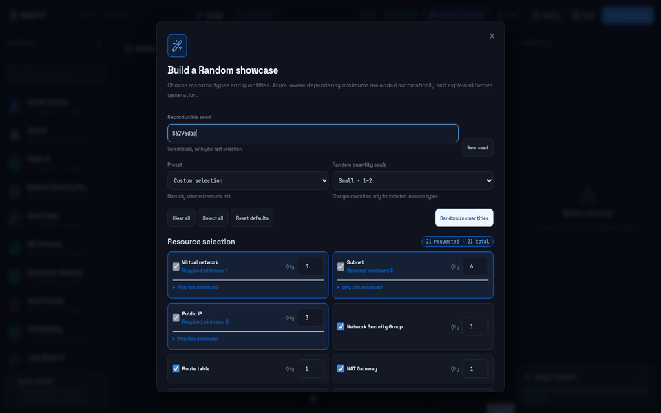
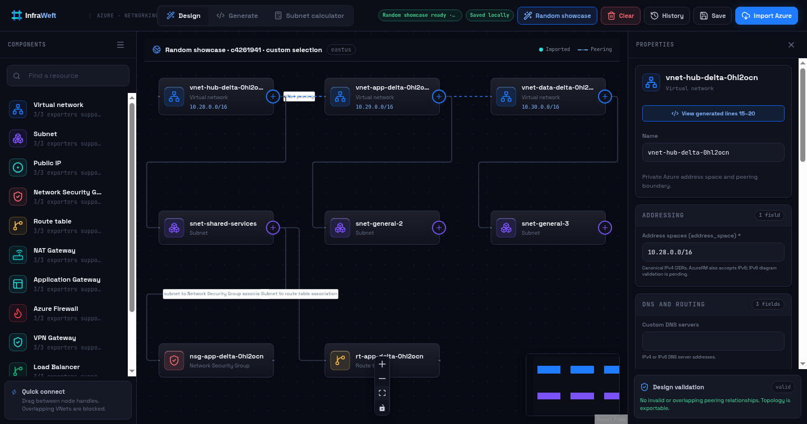
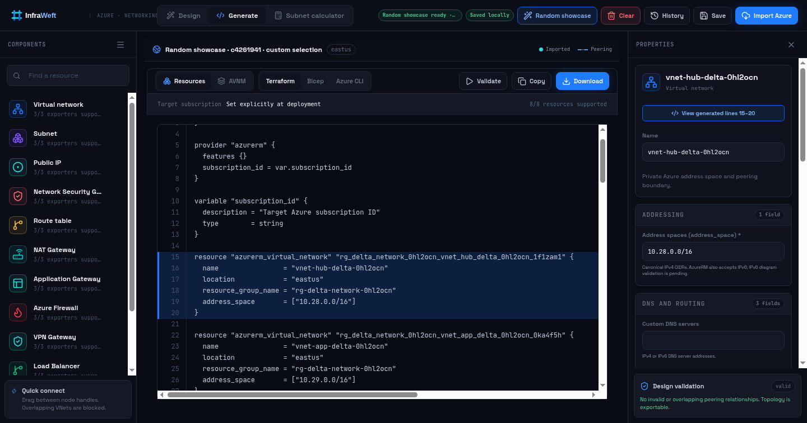

<div align="center">
  

  **Visual cloud infrastructure designer**

  *Weave topology into infrastructure code.*

  [](https://github.com/heyjdev/InfraWeft/actions/workflows/ci.yml)
  [](LICENSE)
  [](package.json)
  
</div>

<p align="center">
  
</p>

InfraWeft is a **local-first visual cloud infrastructure designer**. Weave topology into infrastructure code. Build or import an Azure topology, inspect deployment constraints, and generate deterministic Terraform, Bicep, or Azure CLI artifacts without sending the design to a hosted service.

> [!WARNING]
> InfraWeft is pre-release software. Review generated artifacts and run provider-native validation or deployment what-if before using them against a cloud environment.

## Why InfraWeft

- **Design visually** — compose VNets, subnets, gateways, security controls, edge services, and typed relationships on a React Flow canvas.
- **Generate honestly** — unsupported resources and fields block export instead of disappearing into plausible-looking code.
- **Stay local** — the app binds to `127.0.0.1`; designs and snapshots remain in browser local storage.
- **Import safely** — Azure discovery uses fixed, read-only Azure CLI commands, and imported resources remain reference-only until explicitly adopted.
- **Validate before use** — check generated Terraform, Bicep, and Azure CLI syntax through the loopback-only API. InfraWeft never runs a deployment.

## See it

| Visual design | Generated Terraform |
| --- | --- |
|  |  |

The seeded **Random showcase** produces repeatable, Azure-aware demo topologies and explains every dependency it adds.

## Quick start

### Requirements

- Node.js 20 or newer
- npm

Terraform and Azure CLI are optional. They enable local Terraform validation, Azure discovery, and Bicep compilation.

```bash
git clone https://github.com/heyjdev/InfraWeft.git
cd InfraWeft
npm ci
npm run build
npm start
```

Open <http://127.0.0.1:8787>. To avoid opening a browser automatically:

```bash
npm start -- --no-open
```

Check workstation capabilities with:

```bash
node bin/infraweft.mjs doctor
```

See [Getting started](docs/getting-started.md) for development mode, optional tool setup, and troubleshooting.

## Core workflow

1. **Design** a topology manually or create a deterministic Random showcase.
2. **Inspect** properties, typed relationships, validation findings, and exporter capability.
3. **Import** an Azure topology baseline when needed; VNet address spaces and peerings are discovered, while appliance nodes currently preserve summary identity and scope only. Imported resources stay diagram-only until adoption.
4. **Generate** Terraform, Bicep, or Azure CLI output.
5. **Validate** locally, then review the artifact before any external deployment workflow.

Detailed instructions are in the [User guide](docs/user-guide.md).

## Current scope

InfraWeft currently models Azure virtual networks, subnets, Public IPs, Network Security Groups, route tables, NAT Gateways, Application Gateways, Azure Firewalls, VPN Gateways, Load Balancers, Private Endpoints, Azure Front Door profiles, peering, and selected typed associations.

Terraform, Bicep, and Azure CLI exporters cover the modeled scope and report exact blockers for unsupported or incomplete configuration. “Supported” means InfraWeft emits the fields it claims to model; it does not mean every upstream Azure property or child resource is implemented.

See [Exporters and validation](docs/exporters-and-validation.md) for the capability matrix, Azure Virtual Network Manager conversion, and deployment boundaries.

## Privacy and security

InfraWeft has no application telemetry, advertising, or hosted account service. Local records may still contain sensitive infrastructure metadata such as subscription IDs, resource IDs, names, CIDRs, and topology. Treat browser profiles, screenshots, and exported designs accordingly.

The loopback API validates Host and Origin headers, rate-limits expensive operations, bounds validation inputs, executes fixed tool argument arrays, and never executes generated deployment commands. Read [PRIVACY.md](PRIVACY.md) and [SECURITY.md](SECURITY.md) before using real subscription data.

## Documentation

- [Getting started](docs/getting-started.md)
- [User guide](docs/user-guide.md)
- [Azure import](docs/azure-import.md)
- [Exporters and validation](docs/exporters-and-validation.md)
- [Azure Virtual Network Manager conversion](docs/avnm.md)
- [Changelog](CHANGELOG.md)
- [Privacy and local data](PRIVACY.md)
- [Security policy](SECURITY.md)
- [Support](SUPPORT.md)
- [Contributing](CONTRIBUTING.md)

## Development

```bash
npm ci
npm run dev
```

The UI runs at <http://127.0.0.1:5173> and proxies `/api` to the loopback API at `127.0.0.1:8787`.

Required checks:

```bash
npm test
npm run lint
npm run build
npm run test:package
npm audit
```

## Project status

InfraWeft is Azure-first today, with a provider-neutral product direction for possible AWS and Google Cloud support later. It is not a deployment portal and does not run `terraform apply`, Azure deployments, or generated shell scripts.

Licensed under [Apache-2.0](LICENSE). This independent project is not affiliated with or endorsed by Microsoft or HashiCorp.
