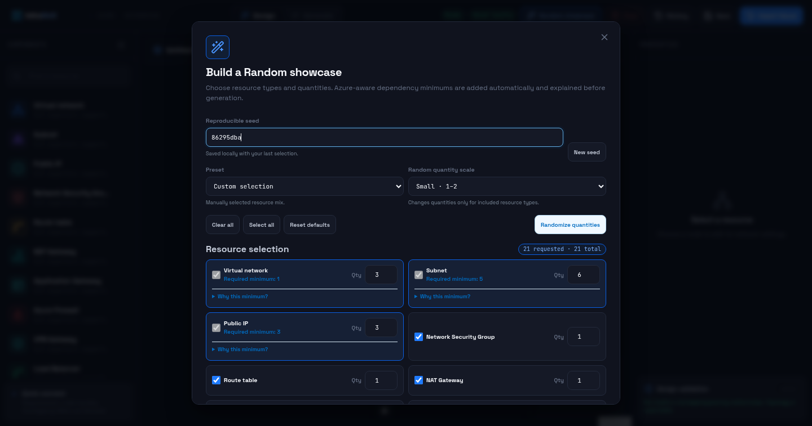

# User guide

## Design workspace

The workspace has four primary areas:

- **Components** — searchable Azure resource palette and exporter support summary.
- **Canvas** — topology, containment, and typed connections.
- **Properties** — selected-resource identity, deployment scope, configuration, and validation.
- **Generate** — exporter selection, diagnostics, field-to-code navigation, validation, copy, and download.

## Build a topology

Drag a component onto the canvas, then select it to configure provider-facing names, location, resource group, lifecycle, and resource-specific fields. Subnets inherit scope from their parent VNet. Typed relationships represent deployment semantics; ordinary visual proximity does not.

InfraWeft rejects invalid relationships such as direct peering between overlapping VNet address spaces. Validation also reports non-canonical CIDRs, missing dependencies, incompatible cardinality, and exporter-specific blockers.

## Random showcase

Select **Random showcase** to build a reproducible demo:

1. Choose a preset or resource types.
2. Set quantities or randomize them.
3. Review dependency minimums added by InfraWeft.
4. Save the displayed seed if you want to reproduce the same design.
5. Confirm replacement of the current canvas.

A nonempty design is snapshotted before replacement. The same seed and selection produce the same topology and layout.

The showcase is a schema-valid demonstration, not proof that every external Azure prerequisite exists. Generated artifacts preserve conspicuous placeholders for dependencies that must be supplied by the operator.

## Save and restore

InfraWeft automatically persists the current design in browser local storage. **Save** creates a named snapshot; **History** restores an earlier one. Up to 20 snapshots are retained.

Browser storage is not a team database or backup system. Treat exported browser profiles as sensitive because designs can contain cloud identifiers and topology.

## Import Azure

**Import Azure** runs fixed, read-only Azure CLI queries through the local API. It discovers VNets, address prefixes, peerings, and supported network appliances from the selected subscription.

Imported resources begin as references and remain diagram-only. Select **Adopt for management** only after reviewing the imported baseline and generated changes. Import is not Terraform state adoption, and InfraWeft does not modify Azure during discovery.

## Generate infrastructure code

Open **Generate** and select Terraform, Bicep, Azure CLI, or Azure Virtual Network Manager conversion.

InfraWeft shows:

- whole-design capability and exact blockers;
- generated output for diagnosis when partial rendering is safe;
- field-to-code links from properties to generated lines;
- node selection from generated resource blocks; and
- local validation results when the required CLI is installed.

Copy and download remain disabled until the selected backend can represent the entire design. This no-silent-drop rule is deliberate.

## Clear a design

**Clear** removes the current design and imported comparison baseline after confirmation. Named snapshots and preferences are separate browser records. Use browser site-data controls if you need to remove all InfraWeft local data.

## Safe operating checklist

Before using generated output:

1. Resolve every InfraWeft blocker and warning.
2. Run the available local validation.
3. Inspect names, scopes, CIDRs, references, and runtime placeholders.
4. Run provider-native plan, compile, or what-if tooling in the target environment.
5. Protect generated files and logs as infrastructure metadata.
6. Never commit credentials, Terraform state, Azure CLI caches, or real topology samples.
